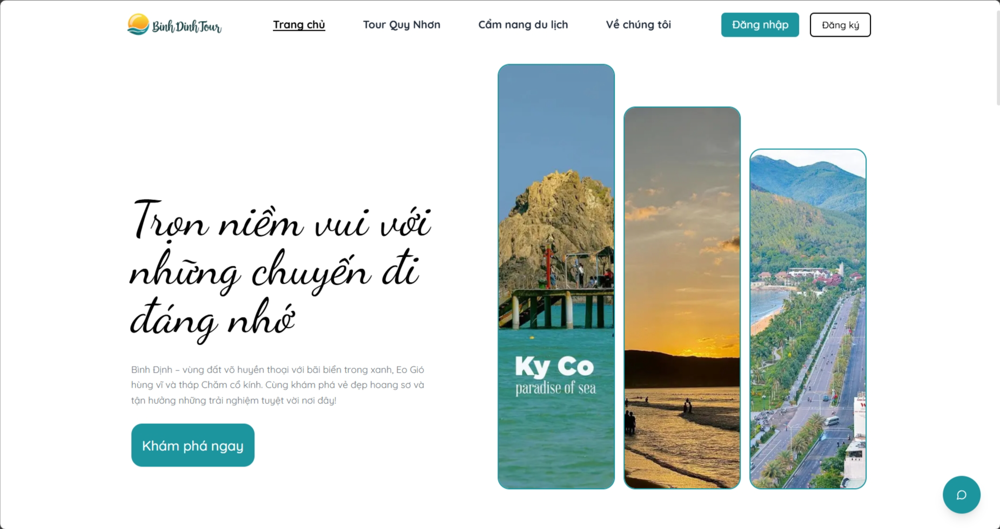

<a id="readme-top"></a>
# BinhDinhTour

The Binh Dinh Tour application is a Next.js-based tourism platform that enables users to discover, book, and experience tours in the Binh Dinh province of Vietnam, with a focus on the Quy Nhon area. 


<div align="center">
  <a href="">
    
  </a>
</div>

## Document
 - [Project Documentation](https://deepwiki.com/dokkazy/dtp-frontend/1-overview)
 - [Capstone Documentation](https://docs.google.com/document/d/16plZ0RT74aM1kNt9pNHC0dKhFs2CeJhc/edit?usp=sharing&ouid=114238383965353353505&rtpof=true&sd=true)
## For backend setup
- [dtp-backend](https://github.com/william-le1004/dtp-backend)

# Application Purpose
The application serves as a comprehensive tourism platform with the following primary functions:

- Browse and search available tours in Binh Dinh
- Filter tours by price, date, and other criteria
- View detailed information about each tour
- Book tours by selecting dates and tickets
- Process payments securely
- Manage bookings and user profiles
- Submit reviews after completing tours

# Acknowledgements

 - [React](https://react.dev/)
 - [Nextjs](https://nextjs.org/)
 - [Shadcn](https://ui.shadcn.com/)
 - [RadixUI](https://www.radix-ui.com/)
 - [MapLibre](https://maplibre.org/)
 - [Zustand](https://zustand-demo.pmnd.rs/)
 - And many other open-source libraries used in package.json

# Development
This guide provides instructions on how to set up and run the project locally.
## Prerequisites
- Ensure you have the following installed:
    - Nodejs (Latest LTS version recommended)
    - GIT
## Setup
### 1. Clone the repository
```bash
git clone https://github.com/dokkazy/dtp-frontend.git
cd dtp-frontend
```
### 2. Install dependencies
```bash
npm install
```
### 3. Configure environment variables
```bash
cp .env.example .env
```
Then, update the necessary environment variables inside .env

### 4. Run the development server
```bash
npm run dev
```
The application should now be available at http://localhost:3000

## Deploy on Vercel

The easiest way to deploy your Next.js app is to use the [Vercel Platform](https://vercel.com/new?utm_medium=default-template&filter=next.js&utm_source=create-next-app&utm_campaign=create-next-app-readme) from the creators of Next.js.

Check out our [Next.js deployment documentation](https://nextjs.org/docs/app/building-your-application/deploying) for more details.

# Contributor

<table>
  <tr align="center">
    <td align="center"><a href="https://github.com/william-le1004"><br /><sub><b>william-le1004</b></sub></a><br />💻</a></td>
    <td align="center"><a href="https://github.com/wnosphan"><br /><sub><b>wnosphan</b></sub></a><br />💻</a></td>
    <td align="center"><a href="https://github.com/dokkazy"><br /><sub><b>Võ Công Huy</b></sub></a><br />💻</a></td>
    </td>
    <td align="center"><a href="https://github.com/ya3k"><br /><sub><b>ya3k</b></sub></a><br />💻</a></td>
   
  </tr>
</table>

<p align="right">(<a href="#readme-top">back to top</a>)</p>
